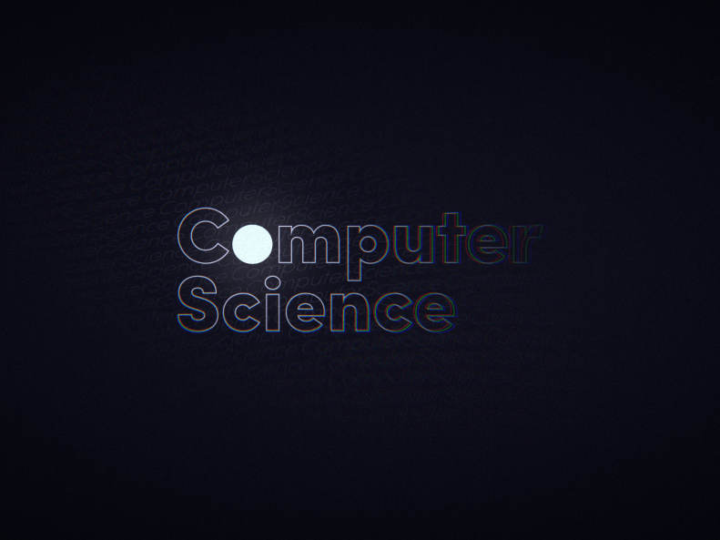

# Computer Science

## Notes

- [C++](https://drive.google.com/file/d/1Z6jYcl4IflYx65NTYwDA29KSbIb3PKUs/view?usp=sharing)
- [Data Structures](https://drive.google.com/file/d/102Rrbii5vxXb4QX0ngXyH0KTdSLFHuA4/view)
- [Database Management System](https://drive.google.com/file/d/1EdZbVsSn3X6XCNR1RoIY7NAS3f2oXvK_/view)
- [PHP (Server-Side Script)](https://drive.google.com/file/d/1OiRaNTFXlYYP6gVTbeUrav1BzbgZhg1A/view)
- [Python Programming](https://drive.google.com/file/d/19QJK9z3k7IgJDFPXY6yFTLbfw8to7AyU/view)

## Projects

- [Online Nursery Plant Shop (Python)](https://drive.google.com/file/d/1eNHKV4lYF72bINnAX5tvaTft5qTbKhS0/view)
- [Web Based Chat App with Webcam (PHP)](https://drive.google.com/file/d/1PwBF8XEBwyVweHCgtVuHZ2SLLstlNmON/view)
- [Arcade Shooter Game (Python)](https://drive.google.com/file/d/1qEoXVf639BAn0ke3x-LjDVY-ccTDpnC2/view)
- [RFID Employee Smart Card For Parking & Canteen Automation PHP Project (PHP)](https://drive.google.com/file/d/1ZCH14QaCYyeJpWUJ9azj7yLzfk0YIari/view)
- [Facial Emotion Detection (Python)](https://drive.google.com/file/d/1u1s8nn_QY29qeAlt4tHhGj4j3CFQpI8K/view)
